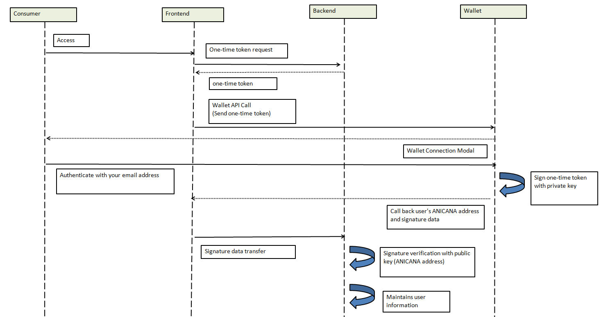

#######################################################
Advanced Security Settings for Wallet Connection
#######################################################

Through the ANICANA Wallet Server, it is possible to obtain a user's address from their content and verify that they are the owner of that address. Below is an example procedure.

| Consumer: User of the content
| Frontend: Content's frontend
| Backend: Content's backend
| Wallet: ANICANA Wallet Server

------------------------------------------------------------------------------------------------------------------------------------------

------------------------------------
One-Time Token
------------------------------------

On the wallet side, simply sign the given text with the user's private key and return it. The signing method used here is the Elliptic Curve Digital Signature Algorithm (ECDSA). Handling this signed data is delegated to the consumer (content) system.
To verify if the owner of the address sent in the callback after login is indeed the user in question, you need to verify this signed data. Since the signer's address can be obtained from the signed data and the message before signing, this can be used as a means of confirming the identity of the declared address. To prevent the reuse of signed data, it is advisable to use disposable target text.

.. caution::
  Please use web3 version 1.9.8.

Example of signature creation::

    var Web3 = require('web3');
    var web3 = new Web3("https://RPC_ENDPOINT");

    var original_message = "Hello world";
    var privateKey = "0xYOURPRIVATEKEYXXXXXXXXXXXXXXXXXXXXXXXXXXXXXXXXXXXXXXXXXXXX"
    var signedData = web3.eth.accounts.sign(original_message, privateKey);

Example of signedData::

    {
        message: 'Hello world',
        messageHash: '0x8144a6fa26be252b86456491fbcd43c1de7e022241845ffea1c3df066f7cfede',
        v: '0x1b',
        r: '0x399ab420d35d6d40e55580317b5fbb907942b6e35f56c22ddd306bd7b13aef8d',
        s: '0x4cedaa39073a5e626043228a20d2a386d9e0a80f5cafb90ac0798559b7b82d1d',
        signature: '0x399ab420d35d6d40e55580317b5fbb907942b6e35f56c22ddd306bd7b13aef8d4cedaa39073a5e626043228a20d2a386d9e0a80f5cafb90ac0798559b7b82d1d1b'
    }   
    // signature is the signed data
    

Verification example::

    var Web3 = require('web3');
    var web3 = new Web3("https://RPC_ENDPOINT");

    var original_message = "Hello world"
    var signature = "XXXXXXXXXXXXXXXXXXXX"   // Signature data sent in the callback
    var signer = web3.eth.accounts.recover(original_message, signature);
    
Example of signer::

    0x7E99a37fFc1D9eCC05C9ac0c65598F8215c01582

