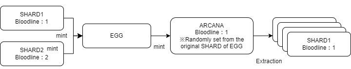

###########################
Bloodline
###########################

Overview
============================================
Bloodline is the lineage to which ARCANA belongs, and every ARCANA belongs to one of the 100 Bloodlines. 
Each Bloodline has an ancestor, and it is inherited as shown in the diagram below, through the cycle of Egg -> ARCANA -> Shard, originating from the ancestor's Shard. 
Newly generated ARCANA randomly inherit one of the two Bloodlines of the Shards used in the birth Egg.

Information Retrieval
============================================
Bloodline information can be obtained by referencing the Bloodline contract. 
The Bloodline contract has the following interfaces.

Retrieving information about a Bloodline (Bloodline.sol)::

    // Returns the ID, name, and number of ARCANA belonging to the specified bloodline
    // @param bloodlineID
    // @return origin ID of the bloodline
    //         nArcanas number of ARCANA belonging to it
    //         name name of the bloodline
    function bloodlineInfo(uint256 bloodlineID) public view returns(
        uint256 origin,
        uint256 nArcanas,
        string memory name
    )

Retrieving the Bloodline to which an ARCANA belongs(Bloodline.sol)::

    // Returns the bloodlineID to which the ARCANA belongs using getBloodline[arcanaID]
    // @param arcanaID
    // @return bloodlineID
    function getBloodline (uint256 arcanaID) public view returns(uint256 bloodlineID)

Retrieving a list of ARCANA belonging to a specific Bloodline (including already burned ARCANA)(Bloodline.sol)::

    // Returns an array of arcanaID belonging to the specified bloodlineID
    // @param bloodlineID
    // @param idx start index
    // @param limit number of items to retrieve
    // @return uint256[] memory array of arcanaID
    function getBelongings(uint256 bloodlineID,uint256 idx, uint256 limit) public view returns(uint256[] memory)

List of Bloodlines
============================================

.. csv-table::
    :header-rows: 1
    :align: center

    "id", "name", "origin"
    "1", "Yahweh", "Christianity, Judaism"
    "2", "Zeus", "Greek Mythology"
    "3", "Indra", "Hinduism"
    "4", "Allah", "Islam"
    "5", "Odin", "Norse Mythology"
    "6", "Buddha", "Buddhism"
    "7", "Heracles", "Greek Mythology"
    "8", "Vishnu", "Hinduism"
    "9", "Hera", "Greek Mythology"
    "10", "Jupiter", "Roman Mythology"
    "11", "Ganesha", "Hinduism"
    "12", "Osiris", "Ancient Egyptian Mythology"
    "13", "Apollo", "Greek Mythology"
    "14", "Mahakala", "Bön, Buddhism"
    "15", "Hari", "Hinduism"
    "16", "Ninhursag", "Sumerian Mythology"
    "17", "Persephone", "Greek Mythology"
    "18", "Kukulkan", "Mayan Mythology"
    "19", "Anubis", "Ancient Egyptian Mythology"
    "20", "Loki", "Norse Mythology"
    "21", "Medusa", "Greek Mythology"
    "22", "Krishna", "Hinduism"
    "23", "Ptah", "Ancient Egyptian Mythology"
    "24", "Shiva", "Hinduism"
    "25", "Athena", "Greek Mythology"
    "26", "Dionysus", "Greek Mythology"
    "27", "Varuna", "Hinduism"
    "28", "Isis", "Ancient Egyptian Mythology"
    "29", "Tirunavayi", "Tamil Deities"
    "30", "Chakra", "Hinduism"
    "31", "Ceres", "Roman Mythology"
    "32", "Nut", "Ancient Egyptian Mythology"
    "33", "Pele", "Hawaiian Mythology"
    "34", "Tiwa-tiwa-k'a", "Hopi Mythology"
    "35", "Pericles", "Greek Mythology"
    "36", "Freya", "Norse mythology"
    "37", "Guinevere", "Arthurian Legend"
    "38", "Acropolis", "Greek Mythology"
    "39", "Romulus", "Roman Mythology"
    "40", "Balder", "Norse Mythology"
    "41", "Tezcatlipoca", "Aztec Mythology"
    "42", "Armadillo", "Amazonian Mythology"
    "43", "Kunbira", "Aboriginal Mythology"
    "44", "Izanami", "Japanese Mythology"
    "45", "Ma'at", "Ancient Egyptian Mythology"
    "46", "Vaishravana", "Buddhism"
    "47", "Shakti", "Hinduism"
    "48", "Galatea", "Greek Mythology"
    "49", "Hachiman", "Japanese Mythology"
    "50", "Tirangirringali", "Aboriginal Mythology"
    "51", "Pan", "Greek Mythology"
    "52", "Manu", "Hinduism"
    "53", "Tlaloc", "Aztec Mythology"
    "54", "Hephaestus", "Greek Mythology"
    "55", "Inti", "Incan Mythology"
    "56", "Ptolemy", "Greek Mythology"
    "57", "Vayu", "Hinduism"
    "58", "Gucumatz", "Mayan Mythology"
    "59", "Frigg", "Norse Mythology"
    "60", "Kumbhak", "Sikhism"
    "61", "Tiwa", "Hopi Mythology"
    "62", "Christ", "Christianity"
    "63", "Yug", "Hinduism"
    "64", "Wandana", "Aboriginal Mythology"
    "65", "Hestia", "Greek Mythology"
    "66", "Him", "Hinduism"
    "67", "Haumia-tiketike", "Maori Mythology"
    "68", "Mahayana", "Buddhism"
    "69", "Zelus", "Greek Mythology"
    "70", "Tantalus", "Greek Mythology"
    "71", "Indro", "Hinduism"
    "72", "Kukumtza", "Incan mythology"
    "73", "Kiwirrkurra", "Aboriginal Mythology"
    "74", "Saraswati", "Hinduism"
    "75", "Hirokud", "Ainu Mythology"
    "76", "Shorosh", "Zoroastrianism"
    "77", "Olokun", "Yoruba Mythology"
    "78", "Agni", "Hinduism"
    "79", "Seb", "Ancient Egyptian Mythology"
    "80", "Kan", "Mayan Mythology"
    "81", "Cthulhu", "Fiction (H.P. Lovecraft's works)"
    "82", "Izanagi", "Japanese Mythology"
    "83", "Ta'aroa", "Polynesian Mythology"
    "84", "Anu", "Sumerian Mythology"
    "85", "Planeto", "Roman Mythology"
    "96", "Tyche", "Greek Mythology"
    "87", "Prometheus", "Greek mythology"
    "88", "Uranus", "Greek Mythology"
    "89", "Bellona", "Roman Mythology"
    "90", "Marikari", "Aboriginal Mythology"
    "91", "Ishtar", "Babylonian Mythology"
    "92", "Hindro", "Javanese Mythology"
    "93", "Krashna", "Judaism"
    "94", "Gwani'n Myin", "Cherokee Mythology"
    "95", "Arak-aye", "Aboriginal Mythology"
    "96", "Utu", "Sumerian Mythology"
    "97", "Illyria", "Greek Mythology"
    "98", "Hikari", "Shintoism"
    "99", "Hecate", "Greek Mythology"
    "100", "Hades", "Greek Mythology"

