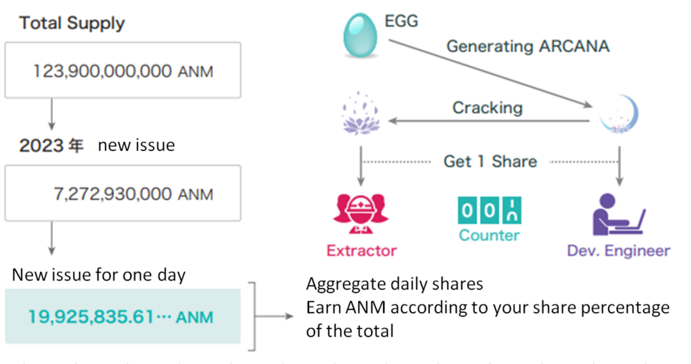

###########################
Obtaining ANM (ANIMA)
###########################

.. attention::

   ANM (ANIMA) is currently not listed, so there is no common method to obtain it.

--------------------------------

What is ANIMA (ANM)?
==========================
ANIMA is the Gas token required for using ANICANA.

----------------------------------------------------------------

Instances Where ANIMA is Required as Gas
=============================================

* When broadcasting MATRIX on the network.
* When generating EGGs on the ANICANA network.
* When generating PERSONAs on the ANICANA network.

Note

* Gas fees are not incurred for regular transactions.
* Transaction gas limit is 700,000,000/tx.
* Block gas limit is 700,000,000/block.

----------------------------------------------------------------

ANIMA Generation Logic
==========================

* When ARCANA is generated from EGGs, development engineers acquire 1 share.
* When ARCANA is dissolved, dissolution engineers acquire 1 share.
* The total amount of ANM generated is determined daily.
* The amount of minted ANM is determined by the shares acquired by each individual during a day.

