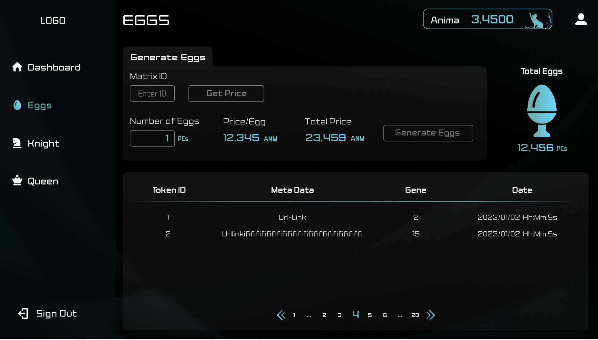
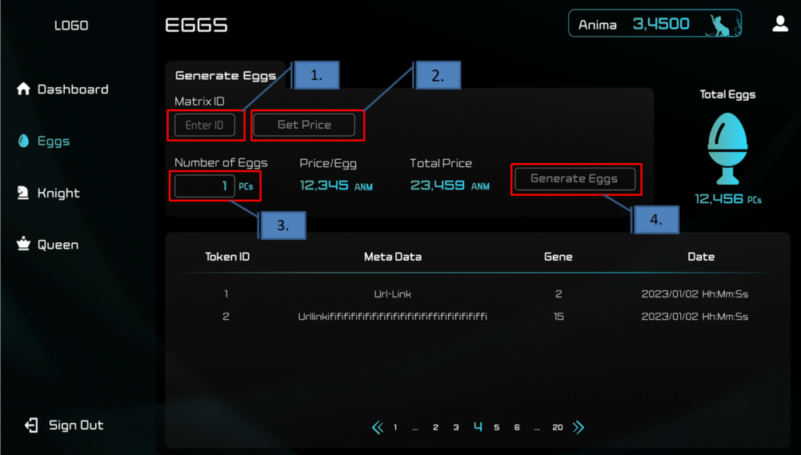

###########################
Generating EGGs
###########################

You can generate EGGs on the EGG page within the Validator management interface.
(Validator management interfaces are deployed separately for each validator, so the URL will be different for each administrator).

--------------------

Generation Process
==========================

1. Enter the MatrixId (ID obtained from development engineers).
2. Get the EGG generation cost with "Get Price".
3. Input the number of EGGs to generate in "Number of eggs".
4. Issue the EGG generation transaction with "Generate Eggs" (consumes ANIMA).

.. admonition:: Regarding the Number of EGGs to Generate

   Please input a value up to a maximum of 1000 in "Number of eggs".
   Values exceeding this limit may result in an error.

.. admonition:: Checkpoints for Failed EGG Generation

   - Ensure you have enough ANM for EGG generation.
   - Ensure you have enough SHARD within the Matrix.
   - Confirm that you possess the Square Key corresponding to the Matrix.

