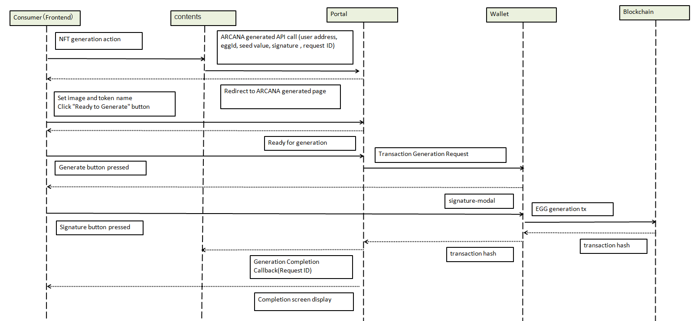

###########################
ARCANA Generation Process
###########################

ARCANA generation is typically performed through the integration of IPFS and the ANICANA Chain smart contract.

* Upload token image to IPFS
* Generate and upload metadata JSON to IPFS
* Generate and possess EGGs
* Generate a signature to grant permission to open the possessed EGGs to users
* Transaction signing by the user
* Execution of the ARCANA generation transaction

Implementing these processes independently on the content side can be complex, so the ANICANA portal provides API support for these operations. Content providers can embed a script tag in their frontend and provide the necessary parameters to navigate users to the ARCANA generation page and facilitate ARCANA generation.

---------------------------------------------------------------------------------------------------------------------------------------------------------------

Integration Flow with ARCANA Generation Page (API)
========================================================

ARCANA Generation on the Testnet
============================================

ARCANA generation on the testnet can be performed using the following steps:

1. Register on the Validator management page with an email address and create a wallet.
2. Obtain the private key of the wallet address generated in the previous step. Use this private key to create a signature. You can obtain the private key using a dedicated website.
3. In the testnet environment, EGGs are not generated from the Validator management page but are issued by the technical support team with administrative privileges.
