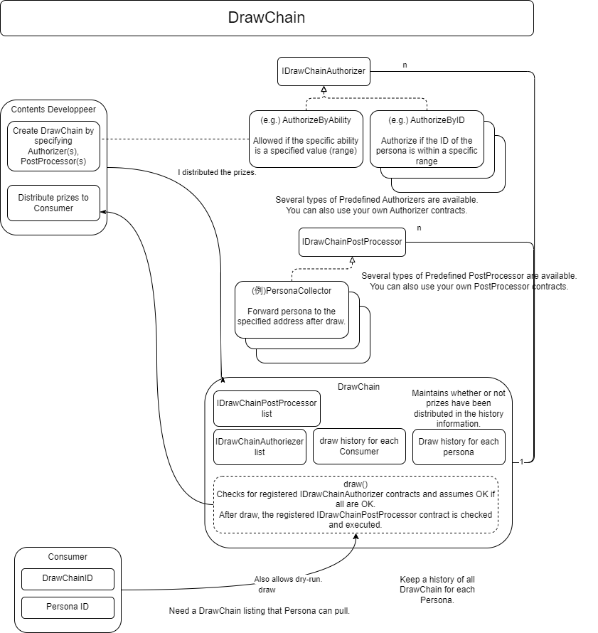

####################################
Implementation of DrawChain
####################################

Overview
============================================

--------------------------------------------------------------------------------------------------------------------------------

Setting Up DrawChain
============================================

| You can configure the conditions for running DrawChain.
| Configuration is possible by registering a contract that inherits the IDrawChainAuthorizer interface.

■ Functions for Publishers

1. Create a contract to set conditions for running DrawChain:

Create a contract that implements the IDrawChainAuthorizer interface (IDrawChainAuthorizer.sol)::

        @param drawChainId DrawChain ID
        @param presetId Preset number (freely defined within the implementation contract)
        @param personaId PERSONA Id
        function authorizeDraw (uint256 drawChainId, uint256 presetId, uint256 personaId) external view returns (bool);

Refer to the environment information for the interface file.

2. Register DrawChain

Register the contract created in step 1 in AuthorizerInfo.
Set the address of the created contract and presetId in AuthorizerInfo.
The usage of presetId can be freely defined within the implementation contract.

Function to register DrawChain (Drawchain.sol)::

        @param squareKey SquareKey associated with DrawChain
        @param _authorizers List of authorizers
        @return DrawChain ID
        function newDrawChain(uint256 squareKey, AuthorizerInfo[] calldata _authorizers) public returns (uint256)

AuthorizerInfo[]::

        struct AuthorizerInfo {
            @notice Address of the IDrawChainAuthorizer contract
            address authorizer;
            @notice Preset ID of the IDrawChainAuthorizer contract
            uint256 presetId;
        }

Setting Active and Inactive States
--------------------------------------------

| During the initial registration, draw capability is set to true.
| DrawChain creators can control the execution of draw. They can change the state to active (true) or inactive (false).

Function to set the active and inactive states of DrawChain (Drawchain.sol):

        @param drawChainId DrawChain ID
        @param active true: draw is possible, false: draw is not possible
        function deactivateDrawChain(uint256 drawChainId, bool active) public;

--------------------------------------------------------------------------------------------------------------------------------

Other DrawChain Functions
============================================

Returning an Array of DrawChain IDs for Which a Specific PERSONA Can Draw (Drawchain.sol)::

        @param from Starting ID of DrawChains to inspect (inclusive)
        @param until Ending ID of DrawChains to inspect (inclusive)
        @param limit Limit the search to this many successful DrawChains (maximum number of elements to return in the array)
        @param personaId PERSONA ID to draw DrawChains
        @return Array of DrawChain IDs where draw is successful
        function availables(uint256 from, uint256 until, uint256 limit, uint256 personaId) public view returns (uint256[] memory)

.. admonition:: Regarding Specified Ranges

  Be cautious when using availables() to search over a wide range, as it may result in gas exhaustion.

Getting DrawChain Information (Drawchain.sol)::

        @param fromId Starting DrawChain ID
        @param count Number of DrawChain information to retrieve
        @return Array of DrawChainInfo
        function getDrawChain(uint256 fromId, uint256 count) public view returns (DrawChainInfo[] memory)

DrawChainInfo::

        struct DrawChainInfo {
            uint256 id;
            uint32 squareKey;
            uint8   active;
            uint8   pad1;
            uint16  pad2;
            uint64  pad3;
            uint128 pad4;
        }

Returning the Number of Draws (History Count) for Each DrawChain (Drawchain.sol)::

        @param drawChainId DrawChain ID
        @return Number of draws (history count)
        function drawHistoryCountByDrawChain(uint256 drawChainId) public view returns (uint256)

Returning the Draw History for Each DrawChain (Batch Version) (Drawchain.sol)::

        @param drawChainId DrawChain ID
        @param fromIdx Starting index (inclusive)
        @param count Number of draw histories to retrieve
        @return Array of draw histories
        function drawHistoryByDrawChain(uint256 drawChainId, uint256 fromIdx, uint256 count) public view returns (History[] memory)

Returning the Number of Draws (History Count) for Each PERSONA (Drawchain.sol)::

        @param personaId PERSONA Id
        @return Number of draws (history count)
        function drawHistoryCountByPersona(uint256 personaId) public view returns (uint256)

Returning the Draw History for Each PERSONA (Batch Version) (Drawchain.sol)::

        @param personaId PERSONA Id
        @param fromIdx Starting index (inclusive)
        @param count Number of draw histories to retrieve
        @return Array of draw histories
        function drawHistoryByPersona(uint256 personaId, uint256 fromIdx, uint256 count) public view returns (History[] memory)

History::

        struct History {
            @notice History ID, same as the value returned by draw()
            uint256 id;
            @notice DrawChain Id
            uint256 drawChainId;
            @notice PERSONA Id
            uint256 personaId;
            @notice Owner of the PERSONA at the time of the draw
            address personaOwner;
            @notice Timestamp when the draw occurred
            uint128 drawnOn;
            @notice Timestamp when the delivery was made
            uint128 deliveredOn;
        }

Returning the Number of Draws (History Count) for Each DrawChain and PERSONA (Drawchain.sol)::

        @param drawChainId DrawChain ID
        @param personaId PERSONA Id
        @return Number of draws (history count)
        function drawHistoryCountByDrawChainAndPersona(uint256 drawChainId, uint256 personaId) public view returns (uint256)

Returning the Draw History for Each DrawChain and PERSONA (Batch Version) (Drawchain.sol)::

        @param drawChainId DrawChain ID
        @param personaId PERSONA Id
        @param fromIdx Starting index (inclusive)
        @param count Number of draw histories to retrieve
        @return Array of draw histories
        function drawHistoryByDrawChainAndPersona(uint256 drawChainId, uint256 personaId, uint256 fromIdx, uint256 count) public view returns (History[] memory)

Returning the Number of Draws (History Count) for Each PERSONA Owner (Drawchain.sol)::

        @param personaOwner Persona owner address
        @return Number of draws (history count)
        function drawHistoryCountByPersonaOwner(address personaOwner) public view returns (uint256)

Returning the Draw History for Each PERSONA Owner (Batch Version) (Drawchain.sol)::

        @param personaOwner Persona owner address
        @param fromIdx Starting index (inclusive)
        @param count Number of draw histories to retrieve
        @return Array of draw histories
        function drawHistoryByPersonaOwner(address personaOwner, uint256 fromIdx, uint256 count) public view returns (History[] memory)

--------------------------------------------------------------------------------------------------------------------------------

Executing DrawChain
============================================

1. Drawing a DrawChain
   Contract: Drawchain

   ■ Function Executed by Users When Performing Operations

   Function to draw a DrawChain (Drawchain.sol):

        @param drawChainId DrawChain ID
        @param personaId PERSONA ID
        @return 0: Draw failed. Non-zero: Index of the history
        function draw(uint256 drawChainId, uint256 personaId) public returns (uint256)

2. Calling the DrawChain creator (Publisher) when distributing prizes and register the timestamp when delivery of prizes is made.

   ■ Function for Publishers

   Function to register a timestamp (Drawchain.sol):

        @param historyId History ID returned when draw is successful
        function delivered(uint256 historyId)

.. admonition:: About Timestamps

  | The delivered() function is optional.
  | When called upon delivering prizes, a timestamp is registered in the deliveredOn field of the History structure.
  | If it is not executed, the only consequence is that the delivery history will not be stored at the blockchain level.
  | The advantages of performing this include:
  | - Timestamps are set at the blockchain level and cannot be tampered with
  | - It can be used for future integration with other programs on the smart contract

--------------------------------------------------------------------------------------------------------------------------------

Implemented IDrawChainAuthorizers
============================================

| The following contracts currently implement the IDrawChainAuthorizer interface and are available for use.
| To enable them, you need to set the contract in the AuthorizerInfo during DrawChain registration.

Contract to Limit the Ability Values of PERSONAs that Can Draw (DrawAbilityLimitter.sol)
====================================================================================================================================
| (DrawAbilityLimitter.sol)
| The ability values need to be set by the square key owner in advance.
| After setting the values, set the contract in AuthorizerInfo during DrawChain registration.
| If the ability values of the PERSONA to be drawn are within the set range, drawing becomes possible.

Functions for Registration::

        @param limit Set the ability value limits. Limit[6] corresponds to FOR, ABS, DFT, MND, INT, EXP, in that order.
        @return numPresets Registration number
        function newPreset(Limit[6] calldata limit) public returns (uint256)

Functions for Modification::

        @notice Specify the registration number for presetId. Only the sender at the time of newPreset can update.
        @param presetId Registration number
        @param limit Set the ability value limits. Limit[6] corresponds to FOR, ABS, DFT, MND, INT, EXP, in that order.
        function alterPreset(uint256 presetId, Limit[6] calldata limit)

Values::

        uint256 public numPresets;                      // Registration number, incremented and assigned automatically by newPreset.
        mapping(uint256 => Limit[6]) public preset;     // Mapping of registration numbers to ability value limit contents
        mapping(uint256 => address) public presetOwner; // Mapping of registration numbers to the sender at the time of newPreset

Limit Structure::

        struct Limit {
            uint16 min;
            uint16 max;
        }

Contract to Limit PERSONA Categories that Can Draw (DrawPersonaCategoryLimitter.sol)
====================================================================================================================================

| (DrawPersonaCategoryLimitter.sol)
| Set the contract in AuthorizerInfo during DrawChain registration and specify the categories you want to assign to presetId.
| If the categories included in the PERSONA Id of the drawing PERSONA match the specified categories in presetId, drawing becomes possible.

Contract to Limit the Number of Draws (DrawQuantityLimitter.sol)
====================================================================================================================================

| (DrawQuantityLimitter.sol)
| Set the contract in AuthorizerInfo during DrawChain registration and specify the number of draws for presetId.
| Drawing is possible if the number of draws made is less than the specified number of draws.

Contract to Limit the Caller of draw() to Subscribers of the Square Key Associated with DrawChain (DrawFollowerLimitter.sol)
====================================================================================================================================

| (DrawFollowerLimitter.sol)
| Set the contract in AuthorizerInfo during DrawChain registration.
| Determine whether the user who made the draw is a follower of the square key associated with the DrawChain.
| If they are a follower, drawing becomes possible

| Subscribers of the square key can be placed on a blacklist.
| Once on the blacklist, Subscribers will be unfollowed and cannot follow again.
| To re-follow, they need to have their registration removed from the blacklist.
| Registration and removal from the blacklist can be done by the owner of the square key.

| 【SquareSupplement.sol】

Functions to Register or Remove from the Blacklist::

        @param squareKey Target square key
        @param _address Follower address
        @param isBlack true: Register, false: Remove from the blacklist
        function setBlackList(uint256 squareKey, address _address, bool isBlack) public

Contract to Limit the Number of draw() Calls by the Same PERSONA (DrawCountLimitter.sol)
====================================================================================================================================

| (DrawCountLimitter.sol)
| Set the contract in AuthorizerInfo during DrawChain registration and specify the number of draws for presetId.
| Drawing is possible if the number of draws made by the same persona is less than the specified number of draws.

Contract to Limit draw() Calls to Specific PERSONAs (DrawPersonaLimitter.sol)
====================================================================================================================================

| (DrawPersonaLimitter.sol)
| Specify the PERSONAs that you want to enable for draw() using newPreset.
| Set the contract in AuthorizerInfo during DrawChain registration and assign the return value from the previous setup to presetId.
| Drawing is possible if the specified PERSONA is included in the designated Preset.

newPreset::

        @param personas Array of PERSONA IDs to be registered
        @return numPresets Registration number
        function newPreset(uint256[] calldata personas) public returns (uint256)
