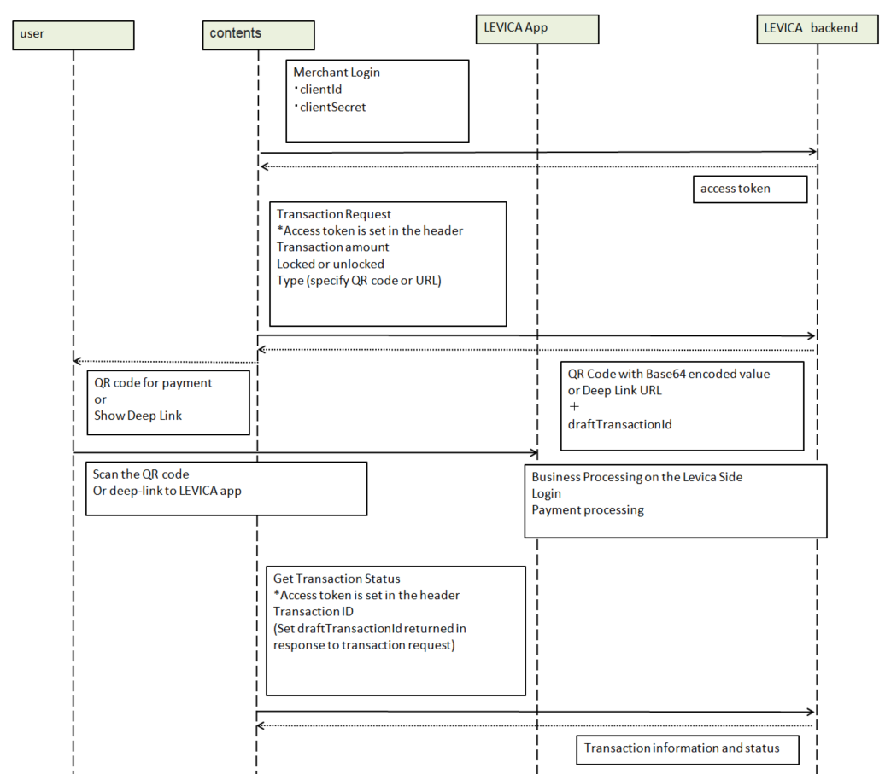

###########################
LEVICA Payment
###########################

This is an electronic money application available for prepaid payments which is used for various products and integrated services deployed on the ANICANA network.

----------------------------------------------------------------------------------------------------------------------------------------------------------------------

API URL Format
=======================================

The URI for the LEVICA REST API follows the format below::

    ${base_url}/v${version}/${resource}.

.. csv-table::
    :header-rows: 1
    :align: center

    "Field", "Description"
    "base_url", "URL of the server hosting the API. 'base_url' is the same for all APIs."
    "version", "API version."
    "resource", "Unique name assigned to each API."

----------------------------------------------------------------------------------------------------------------------------------------------------------------------

Environment Information
=======================================

Please refer to each environment information page.

----------------------------------------------------------------------------------------------------------------------------------------------------------------------

Request Authentication
=======================================

The LEVICA system exchanges data in a RESTful format.

* Request Authentication

To access resources of the system using the REST API, merchant authentication is required first. Authentication is performed using the merchant's clientId and clientSecret. The system provides a login REST API to execute the authentication. The clientId and clientSecret are passed to the system with this request. The system compares whether the clientId and clientSecret match the values in the database and checks them. If they match, the system creates an access token specific to the merchant, and these tokens are returned to the caller as a response to the authentication request. Access tokens contain the necessary merchant information, and these access tokens need to be stored. Therefore, when the system receives an access token with a REST API request, it can verify the merchant's authentication information.

Pattern 1

.. csv-table::
    :header-rows: 1
    :align: center

    "Header Key", "Type", "Required", "Description"
    "Content-Type", "String", "Yes", "Content type of the request body."
    "Accept", "String", "No", "Indicates the content type."

Pattern 2

.. csv-table::
    :header-rows: 1
    :align: center

    "Header Key", "Type", "Required", "Description"
    "Authorization", "String", "Yes", "Access token."
    "Content-Type", "String", "Yes", "Content type of the request body."
    "Accept", "String", "No", "Indicates the content type."

| ＊For browsers, the device type is not required.
| ＊If the API has an option for file upload, the Content-Type will be 'multipart/form-data.' For other POST/PUT APIs, the Content-Type will be 'application/json.'

.. caution:: 
   You must first apply for merchant registration with LEVICA and obtain the clientId and clientSecret.

----------------------------------------------------------------------------------------------------------------------------------------------------------------------

Integration Flow with LEVICA
=======================================

Main APIs for Integration
=======================================
Listed below are the main APIs used to implement LEVICA Payment.

* Merchant Login

+-----------------------+--------------------------------------------------------------------------------------------------------------------------------+
| Request URI           | ${base_url}/$v{version}/merchant/login                                                                                         |
+-----------------------+--------------------------------------------------------------------------------------------------------------------------------+
| Method                | post                                                                                                                           |
+-----------------------+--------------------------------------------------------------------------------------------------------------------------------+
| Objective             | Log in as a merchant                                                                                                           |
+-----------------------+--------------------------------------------------------------------------------------------------------------------------------+
| Request                                                                                                                                                |
+-----------------------+--------------------------------------------------------------------------------------------------------------------------------+
|  Request Header       | | Content-Type: application/json                                                                                               |
|                       | | Accept: application/json                                                                                                     |
+-----------------------+---------------+------------+--------------+------------------------------------------------------------------------------------+
|  Request  Parameters  | Field         |  Type      | Required     | Description                                                                        |
|                       +---------------+------------+--------------+------------------------------------------------------------------------------------+
|                       | clientId      |  String    | Yes          | | Merchant  clientId                                                               |
|                       |               |            |              | | The value provided by the issuer when the merchant is registered with LEVICA     |
|                       +---------------+------------+--------------+------------------------------------------------------------------------------------+
|                       | clientSecret  |  String    | Yes          | | Merchant  clientSecret                                                           |
|                       |               |            |              | | The value provided by the issuer when the merchant is registered with LEVICA     |
+-----------------------+---------------+------------+--------------+------------------------------------------------------------------------------------+
|  Sample request body  | | {                                                                                                                            |
|                       | | "clientId": "6779ef20e75817b79602",                                                                                          |
|                       | | "clientSecret": "GBAyfVL7YWtP6gudLIjbRZV_N0dW4f3xETiIxqtokEAZ6FAsBtgyIq0MpU1uQ7J08xOTO2zwP0OuO3                              |
|                       | | pMVAUTid"                                                                                                                    |
|                       | | }                                                                                                                            |
+-----------------------+--------------------------------------------------------------------------------------------------------------------------------+
| Response                                                                                                                                               |
+-----------------------+--------------------------------------------------------------------------------------------------------------------------------+
|  Success Response     | Http status code: 200                                                                                                          |
|                       +--------------------------------------------------------------------------------------------------------------------------------+
|                       | | {                                                                                                                            |
|                       | |  "accessToken": {                                                                                                            |
|                       | |  "token": "VVNFUl9BQ0NFU1NfVE9LRU4jTVdNMk16Z3hPRFUxTnpNeU1HRXlNVFE1TXpZMU16QTBOMk0yTldWaU9XUm1PVG                            |
|                       | |   d6TmpjNFpRPT0jMjAyMi0xMC0yNyAxMTo1Mzo1MS4zNzEjMjAyMi0xMC0yNiAxMTo1Mzo1MS4zNzEjLTg1Mjk1NzkyNA==",                           |
|                       | |   "expiredAt": "2022-10-27T06:23:51.371+00:00"                                                                               |
|                       | |  },                                                                                                                          |
|                       | |  "merchantId": 33,                                                                                                           |
|                       | |  "merchantName": "Merchant Name New s",                                                                                      |
|                       | |  "callBackUrl": "https://merchanttest.com",                                                                                  |
|                       | |  "clientId": "1c63818557320a21493653047c65eb9df983678e",                                                                     |
|                       | |  "address": "0x1563929dcbcaea559734d78a0e864ee680649726"                                                                     |
|                       | | }                                                                                                                            |
+-----------------------+--------------------------------------------------------------------------------------------------------------------------------+
|  Error Response       | Http status code: 400, Unauthorized                                                                                            |
|                       +--------------------------------------------------------------------------------------------------------------------------------+
|                       | | {                                                                                                                            |
|                       | |  "error": "email or password is incorrect"                                                                                   |
|                       | | }                                                                                                                            |
+-----------------------+--------------------------------------------------------------------------------------------------------------------------------+

* Transaction Request

+-----------------------+------------------------------------------------------------------------------------------------------+
| Request URI           | ${base_url}/$v{version}/merchant/transaction                                                         |
+-----------------------+------------------------------------------------------------------------------------------------------+
| Method                | post                                                                                                 |
+-----------------------+------------------------------------------------------------------------------------------------------+
| Objective             | Transaction Initiation                                                                               |
+-----------------------+------------------------------------------------------------------------------------------------------+
| Request                                                                                                                      |
+-----------------------+------------------------------------------------------------------------------------------------------+
|  Request Header       | | Content-Type: application/json                                                                     |
|                       | | Accept: application/json                                                                           |
|                       | | Authorization: merchant_access_token                                                               |
+-----------------------+---------------+------------+--------------+----------------------------------------------------------+
|  Request  Parameters  | Field         |  Type      | Required     | Description.                                             |
|                       +---------------+------------+--------------+----------------------------------------------------------+
|                       | amount        |  Long      | Yes          | Amount of transaction                                    |
|                       +---------------+------------+--------------+----------------------------------------------------------+
|                       | isLock        |  byte      | No           | | 0 : No lock (default setting)                          |
|                       |               |            |              | | 1 : lock                                               |
|                       +---------------+------------+--------------+----------------------------------------------------------+
|                       | type          |  byte      | Yes          | | 1 : Generate QR Code                                   |
|                       |               |            |              | | 2 : Generate deep link URLs                            |
+-----------------------+---------------+------------+--------------+----------------------------------------------------------+
|  Sample request body  | | {                                                                                                  |
|                       | |  "amount": 10000,                                                                                  |
|                       | |  "isLock": 1,                                                                                      |
|                       | |  "type": 1                                                                                         |
|                       | | }                                                                                                  |
+-----------------------+------------------------------------------------------------------------------------------------------+
| Response                                                                                                                     |
+-----------------------+------------------------------------------------------------------------------------------------------+
|  Success Response     | Http status code: 200                                                                                |
|                       +------------------------------------------------------------------------------------------------------+
|                       | | ・type=1                                                                                           |
|                       | | {                                                                                                  |
|                       | |   "type" : 1,                                                                                      |
|                       | |   "hasLock" : 1,                                                                                   |
|                       | |   "data" : "<Base64_Encoded_String>",                                                              |
|                       | |   "draftTransactionId" : "D102656693ac3ca6e0cdafbfe89ab99",                                        |
|                       | |   "value" :"<Deep Link URI>",                                                                      |
|                       | |   "createdDate" : "2022-09-1T18:25"                                                                |
|                       | | }                                                                                                  |
|                       | |                                                                                                    |
|                       | | QR code in Base64 Encoded Value                                                                    |
|                       | | //Decoding base64 values provides QR codes in image format                                         |
|                       | |                                                                                                    |
|                       | | ・type=2                                                                                           |
|                       | | {                                                                                                  |
|                       | |   "type" : 2,                                                                                      |
|                       | |   "hasLock" : 1,                                                                                   |
|                       | |   "data" : "<Web-URI-to-make-payment>",                                                            |
|                       | |   "draftTransactionId" : "D102656693ac3ca6e0cdafbfe89ab99",                                        |
|                       | |   "value" : null,                                                                                  |
|                       | |   "createdDate" : "2022-09-1T18:25"                                                                |
|                       | | }                                                                                                  |
+-----------------------+------------------------------------------------------------------------------------------------------+
|  Error Response       | Http status code: 401, Unauthorized                                                                  |
|                       +------------------------------------------------------------------------------------------------------+
|                       |  | {                                                                                                 |
|                       |  | "message": "Invalid access token",                                                                |
|                       |  | "code": "6001"                                                                                    |
|                       |  | }                                                                                                 |
|                       +------------------------------------------------------------------------------------------------------+
|                       | Http status code: 400, Bad Request                                                                   |
|                       +------------------------------------------------------------------------------------------------------+
|                       |  | {                                                                                                 |
|                       |  | "message": "Amount should be greater than zero",                                                  |
|                       |  | "code": "1003"                                                                                    |
|                       |  | }                                                                                                 |
|                       +------------------------------------------------------------------------------------------------------+
|                       | Http status code: 400, Bad Request                                                                   |
|                       +------------------------------------------------------------------------------------------------------+
|                       |  | {                                                                                                 |
|                       |  | "message": "Invalid Lock status",                                                                 |
|                       |  | "code": "1002"                                                                                    |
|                       |  | }                                                                                                 |
|                       +------------------------------------------------------------------------------------------------------+
|                       |  | {                                                                                                 |
|                       |  | "message": "Invalid Payment type",                                                                |
|                       |  | "code": "1001"                                                                                    |
|                       |  | }                                                                                                 |
|                       +------------------------------------------------------------------------------------------------------+
|                       | Http status code: 404, Not Found                                                                     |
|                       +------------------------------------------------------------------------------------------------------+
|                       |  | {                                                                                                 |
|                       |  | "message": "Merchant Address not found",                                                          |
|                       |  | "code": "2005"                                                                                    |
|                       |  | }                                                                                                 |
|                       +------------------------------------------------------------------------------------------------------+
|                       | Http status code: 400, Bad Request                                                                   |
|                       +------------------------------------------------------------------------------------------------------+
|                       |  | {                                                                                                 |
|                       |  | "message": "No user found",                                                                       |
|                       |  | "code": "1005"                                                                                    |
|                       |  | }                                                                                                 |
+-----------------------+------------------------------------------------------------------------------------------------------+

* Get Transaction Status

+-----------------------+------------------------------------------------------------------------------------------------------+
| Request URI           | ${base_url}/$v{version}/merchant/transaction/{transactionID}/status                                  |
+-----------------------+------------------------------------------------------------------------------------------------------+
| Method                | get                                                                                                  |
+-----------------------+------------------------------------------------------------------------------------------------------+
| Objective              | Get transaction status                                                                              |
+-----------------------+------------------------------------------------------------------------------------------------------+
| Request                                                                                                                      |
+-----------------------+------------------------------------------------------------------------------------------------------+
|  Request Header       | | Content-Type: application/json                                                                     |
|                       | | Accept: application/json                                                                           |
|                       | | Authorization: merchant_access_token                                                               |
+-----------------------+---------------+------------+--------------+----------------------------------------------------------+
|  Request  Parameters  | Field         |  Type      | Required     | Description.                                             |
|                       +---------------+------------+--------------+----------------------------------------------------------+
|                       | transactionID |  String    | Yes          | Draft-TransactionID obtained from TransactionRequestAPI  |
+-----------------------+---------------+------------+--------------+----------------------------------------------------------+
|  Sample request body  | Empty                                                                                                |
+-----------------------+------------------------------------------------------------------------------------------------------+
| Response                                                                                                                     |
+-----------------------+------------------------------------------------------------------------------------------------------+
|  Success Response     | Http status code: 200                                                                                |
|                       +------------------------------------------------------------------------------------------------------+
|                       | | {                                                                                                  |
|                       | |  "tempTransactionID":  "D5a321108871ea447db69a56404ad65ae46d0073bc68fa91fc60f579f8305ec4b",        |
|                       | |   "transactionId": "4833ea425b55599d97dd700878e0c3a4bf5e276e70edb8636344aa434447bd56",             |
|                       | |   "isLock": 1,                                                                                     |
|                       | |   "type": 1,                                                                                       |
|                       | |   "status": 3, // 1 => pending, 2 => Payment completed, 3=> Transaction completed successfully,    |
|                       | |                   4=> transaction fail, 5=> transaction canceled.                                  |
|                       | |                   Additional status information is provided outside the column.                    |
|                       | |   "amount": "500",                                                                                 |
|                       | |   "fromAddress": "0x5J3mBbAH58CpQ3Y5RNJpUKP",                                                      |
|                       | |   "toAddress": "0xPKUpJNR5Y3QpC85HAbBm3J5",                                                        |
|                       | |   "transactionCreateDate": "2022-08-16T09:21:49.000+00:00",                                        |
|                       | |   "transactionPaymentDate": "2022-08-16T10:21:49.000+00:00",                                       |
|                       | |   "transactionCompleteDate": "2022-08-17T09:21:49.000+00:00"                                       |
|                       | | }                                                                                                  |
+-----------------------+------------------------------------------------------------------------------------------------------+
|  Error Response       | Http status code: 401, Unauthorized                                                                  |
|                       +------------------------------------------------------------------------------------------------------+
|                       |  | {                                                                                                 |
|                       |  | "message": "Invalid access token",                                                                |
|                       |  | "code": "6001"                                                                                    |
|                       |  | }                                                                                                 |
|                       +------------------------------------------------------------------------------------------------------+
|                       | Http status code: 404,  Not Found                                                                    |
|                       +------------------------------------------------------------------------------------------------------+
|                       |  | {                                                                                                 |
|                       |  | "message": "No transaction found",                                                                |
|                       |  | "code": "1006"                                                                                    |
|                       |  | }                                                                                                 |
+-----------------------+------------------------------------------------------------------------------------------------------+

※If status is 2 or more, the settlement can be considered complete; if status 4 or 5 we can conclude that there is no problem with the content side because the content is at the blockchain level.

----------------------------------------------------------------------------------------------------------------------------------------------------------------------

Testing in the Staging Environment
=======================================
In the staging environment, you can perform tests by charging the balance using test card numbers. The payment system uses Stripe, so you can use the following card numbers:

.. csv-table::
    :header-rows: 1
    :align: center

    "Card Company", "Card Number", "Expiration Date", "Security Code", "Other Form Fields"
    "Visa", "4242 4242 4242 4242", "Valid future date", "Any 3-digit security code", "Any value"
    "Visa (Debit)", "4000 0566 5566 5556", "Valid future date", "Any 3-digit security code", "Any value"
    "Mastercard", "5555 5555 5555 4444", "Valid future date", "Any 3-digit security code", "Any value"
    "Mastercard (Debit)", "5200 8282 8282 8210", "Valid future date", "Any 3-digit security code", "Any value"
    "Mastercard (Prepaid)", "5105 1051 0510 5100", "Valid future date", "Any 3-digit security code", "Any value"
    "American Express", "3782 822463 10005", "Valid future date", "Any 4-digit security code", "Any value"
