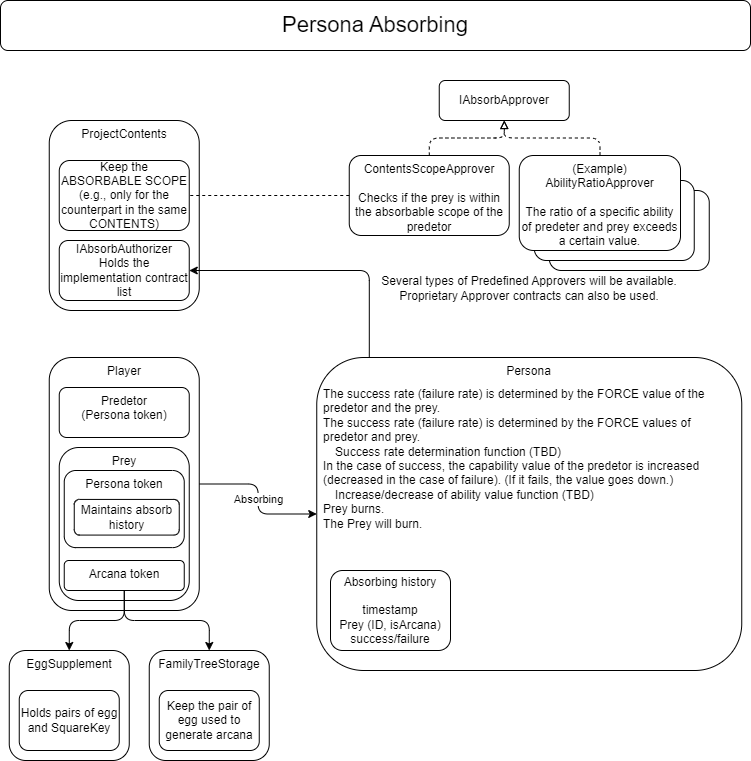

###########################
Absorbing
###########################

Overview Diagram
============================================

--------------------------------------------------------------------------------------------------------------------------------

Setting Absorbing Conditions
============================================

Publishers can set the absorption targets for PERSONA. (Unlimited targets are also possible)

------------------------------------------------------------------------
Prerequisites
------------------------------------------------------------------------
| Reverting occurs if the prerequisites are not met.
| ・The predator (PERSONA) must own the address calling the function.
| ・It must be a combination of predator (PERSONA) and prey (ARCANA) permitted by AbsorbAuthority.

------------------------------------------------------------------------
Restricting the Execution of absorb()
------------------------------------------------------------------------
| As mentioned in the prerequisites, absorb() must be a combination of predator and prey permitted by AbsorbAuthority.
| To restrict the execution of absorb(), you need to configure AbsorbAuthority.
| AbsorbAuthority can operate contracts that inherit multiple IAbsorbApprover interfaces for each PERSONA category of Predator.
| Except for numAbsorbApprovers, only the owner of the square key can operate the following functions.

| The steps are as follows.

① Create a contract to restrict the execution of absorb()
^^^^^^^^^^^^^^^^^^^^^^^^^^^^^^^^^^^^^^^^^^^^^^^^^^^^^^^^^^^^^^^^^^

Create a contract that implements the IAbsorbApprover interface (IAbsorbApprover.sol)::

        @param presetId Preset number (freely defined in the implementation contract)
        @param predator PERSONA Id on the absorbing side
        @param prey PERSONA Id on the absorbed side
        @return true: absorbable, false: not absorbable
        function approveAbsorb(uint256 presetId,uint256 predator,uint256 prey) external view returns (bool)

Refer to the environment information for the interface file.

② Register the created contract
^^^^^^^^^^^^^^^^^^^^^^^^^^^^^^^^^^^^^^^^^^^^^^^^^^^^^^^^^^^^^^^^^^

Register the contract using the function (AbsorbAuthority.sol)::

        @param contentsId Content ID (contentsId & SquareKey)
        @param contractAddr Contract address that inherits IAbsorbApprover
        @param presetId The presetId of contractAddr, the usage of preset Id depends on the implementation contract of IAbsorbApprover.
        @return Index of the AbsorbApprover array for each registered Content ID
        function addAbsorbApprover(uint32 contentsId,address contractAddr,uint256 presetId) public returns (uint256)

------------------------------------------------------------------------------------------------------------------------------------------------

------------------------------------------------------------------------
Other Functions for Setting absorb() Conditions
------------------------------------------------------------------------

Delete registered ApproverInfo (AbsorbAuthority.sol)
^^^^^^^^^^^^^^^^^^^^^^^^^^^^^^^^^^^^^^^^^^^^^^^^^^^^^^^^^^^^^^^^^^^^^^^^^^^^^^^^^^^^^^^^^^^^
::

        @param contentsId Content ID (contentsId & SquareKey)
        @param idx Index of the AbsorbApprover array for each Content ID
        function removeApprover(uint32 contentsId,uint256 idx)

Replace registered ApproverInfo (AbsorbAuthority.sol)
^^^^^^^^^^^^^^^^^^^^^^^^^^^^^^^^^^^^^^^^^^^^^^^^^^^^^^^^^^^^^^^^^^^^^^^^^^^^^^^^^^^^^^^^^^^^
::

        @param contentsId Content ID (contentsId & SquareKey)
        @param idx Index of the AbsorbApprover array for each Content ID
        @param contractAddr Contract address that inherits IAbsorbApprover
        @param presetId The presetId of contractAddr, the usage of preset Id depends on the implementation contract of IAbsorbApprover.
        function replaceApprover(uint32 contentsId,uint256 idx,address contractAddr,uint256 presetId)

Get the number of registered AbsorbApprovers for each Content ID (AbsorbAuthority.sol)
^^^^^^^^^^^^^^^^^^^^^^^^^^^^^^^^^^^^^^^^^^^^^^^^^^^^^^^^^^^^^^^^^^^^^^^^^^^^^^^^^^^^^^^^
::

        @param contentsId Content ID (contentsId & SquareKey)
        @return Number of registered AbsorbApprovers for each Content ID
        function numAbsorbApprovers(uint32 contentsId) public view returns (uint256)

AbsorbApprover list for each Content (AbsorbAuthority.sol)
^^^^^^^^^^^^^^^^^^^^^^^^^^^^^^^^^^^^^^^^^^^^^^^^^^^^^^^^^^^^^^^^^^^^^^^^^^^^^^^^^^^^^^^^^^^^
::

        @notice Available with approverList(contentsId)
        mapping(uint32 => ApproverInfo[]) public approverList;

ApproverInfo
^^^^^^^^^^^^^^^^^^^^^^^^^^^^^^^^^^^^^^^^^^^^^^^^^^^^^^^^^^^^^^^^^^^^^^^^^^^^^^^^^^^^^^^^^^^^
::

        struct ApproverInfo {
            @notice Address of the AbsorbAprover contract
            address approver;
            @notice Preset ID of the AbsorbAprover contract to be used
            uint256 presetId;
        }

Get SquareKey from arcanaId (EggSupplement.sol)
^^^^^^^^^^^^^^^^^^^^^^^^^^^^^^^^^^^^^^^^^^^^^^^^^^^^^^^^^^^^^^^^^^^^^^^^^^^^^^^^^^^^^^^^^^^^
::

        @param arcanaId ARCANA token ID
        @return SquareKey associated with arcanaId
        function arcanaToSquareKey(uint256 arcanaId) external view returns (uint256) 

------------------------------------------------------------------------------------------------------------------------------------------------

------------------------------------------------------------------------
Implemented IAbsorbApprover
------------------------------------------------------------------------
| Currently, the following contracts implementing the IAbsorbApprover interface are available.
| To enable them, you need to register the contracts with AbsorbAuthority using addAbsorbApprover().

Contracts Limited by Square Key
^^^^^^^^^^^^^^^^^^^^^^^^^^^^^^^^^^^^^^^^^^^^^^^^^^^^^^^^^^^^^^^^^^^^^^^^^^^^^^^^^^^^^^^^^^^^^^^^^^^^^^^^^^^^

| (ContentsScopeApprover.sol)
| A contract that limits absorbability based on the square key associated with PERSONA and ARCANA

| PERSONA of the predatorContents specified in the function can only target  ARCANAs of the preyContents specified category. 
| To enable absorbing restrictions by ContentsScopeApprover, add restrictions with the following function and register the contract with AbsorbAuthority.

To add restrictions with ContentsScopeApprover, use the following function.::

        @notice Set the absorbability list for each content
        @param predatorContents Predator (PersonaId)
        @param preyContents     Prey (ArcanaId)
        @param mask             0xffff0000 (the lower 16 bits are unused)
        @param arc              Always set to true and 0
        function setAbsorbScope(uint32 predatorContents,uint32 preyContents,uint32 mask,uint8  arc) public;

Contract for Time Restriction on Re-execution
^^^^^^^^^^^^^^^^^^^^^^^^^^^^^^^^^^^^^^^^^^^^^^^^^^^^^^^^^^^^^^^^^^^^^^^^^^^^^^^^^^^^^^^^^^^^^^^^^^^^^^^^^^^^

| (AbsorbIntervalApprover.sol)
| A contract that prevents the execution of absorbing until a certain period has elapsed since the previous absorbing.
| Set the time in milliseconds for re-absorbability when registering the contract with AbsorbAuthority using the presetId.

