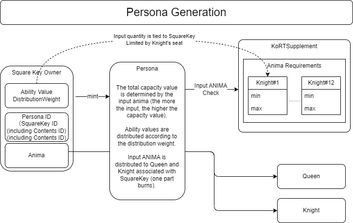

#####################################
Generating and Distributing PERSONA
#####################################

Overview Diagram
============================================

--------------------------------------------------------------------------------------------------------------------------------

Generating PERSONA
============================================
| Generating PERSONA requires consuming ANIMA. The initial attributes are determined based on the amount of ANIMA deposited during minting. A higher deposit results in higher attribute values.
| The deposit amount can be set within the range specified by the seat number of the Knight to which you belong.
| The distribution ratio of attributes other than FORCE can be determined by the publisher, while FORCE has a fixed ratio.

----------------------------------------------------------------------------------------------------------------------------------------------------------------------------------------------------------------------------------------------------------------

Absorbing
============================================
Refer to `here <../game-development/persona-absorb.html>`_ for details.

--------------------------------------------------------------------------------------------------------------------------------

PERSONA Contract
=============================================================

■ Functions for Publishers

Generating PERSONA (Persona.sol)
^^^^^^^^^^^^^^^^^^^^^^^^^^^^^^^^^^^^^^^^^^^^^^^^^^^^^^^^^^^^^^^^^^^^^^^^^^^^^^^^^^^^^^^^^^^^
::

         @param to The address where PERSONA is generated.
         @param fromId The starting value of the ID portion of the minted Persona. The generated Persona token ID has the following structure for 256-bit data:
         The token ID of the generated persona token has a value from fromId to fromId + numTokens - 1
         All IDs must be unused.
          255                     32 31         16 15          0
         +--------------------------+-------------+-------------+
         |  persona id in contents  | square key  | contents id |
         +--------------------------+-------------+-------------+
         @param numTokens The number of Persona tokens to mint.
         @param conditions MintCondition
         @return An array of generated Persona token IDs.
         function mintBatch(address to, uint256 fromId, uint256 numTokens, MintCondition[] calldata conditions) public onlyMinter returns (uint256[] memory tokens)

Generating PERSONA (No Array Version) (Persona.sol)
^^^^^^^^^^^^^^^^^^^^^^^^^^^^^^^^^^^^^^^^^^^^^^^^^^^^^^^^^^^^^^^^^^^^^^^^^^^^^^^^^^^^^^^^^^^^
::

         function mintBatchUnified(address to, uint256 fromId, uint256 numTokens, MintCondition calldata condition) public returns (uint256[] memory tokens)

.. admonition:: Determining fromId

  The fromId used for minting can be obtained using the findAvailableIds function described below.

MintCondition
^^^^^^^^^^^^^^^^^^^^^^^^^^^^^^^^^^^^^^^^^^^^^^^^^^^^^^^^^^^^^^^^^^^^^^^^^^^^^^^^^^^^^^^^^^^^
::

         @param animaAmounts The amount of Anima tokens to be deposited for minting each Persona. The array's length must be numTokens.
         The total amount of anima in this array must be approved to the Persona contract before calling this function.
         The deposit amount must be within the minimum and maximum deposit limits set for the square key's associated Knight's seat.
         @param weightsList Weight allocation for the attributes of each generated Persona. The array's length must be numTokens. Each element has the following structure:
         weights[n][0] Weight of ABS for the nth generated persona
         weights[n][1] Weight of DFT for the nth generated persona
         weights[n][2] Weight of MND for the nth generated persona
         weights[n][3] Weight of INT for the nth generated persona
         weights[n][4] Weight of EXP for the nth generated persona

         struct MintCondition {
             uint256  animaAmounts; // Amount of anima deposited
             uint64   elements;     // Specify the element (0~6)
             uint8[5] weights;      // Weight allocation for the attributes of each generated Persona
             string   metadata;     // Set metadata
         }

| ※ Elements can be specified for PERSONA as described in the `lottery probability table of Elements <../contract-info/attributes.html>`__.

About PERSONA's Attribute Values::

        PERSONA has six attribute values as parameters:
        Attribute values are subject to increase or decrease through Absorbing.
        These attributes are also used as conditions for DrawChain execution.

            FOR (Force/Energy)
            ABS (Abyss)
            DFT (Determination)
            MND (Mind)
            INT (Intelligence)
            EXP (Experience)

About Metadata::

         Set metadata using the following steps:
         ・Upload the desired image to IPFS and obtain the hash.
         ・Upload a JSON file to IPFS and obtain the hash.
         ・Set the obtained hash in the metadata.
         The JSON file format should be as follows:
         
         {
             "name": "persona", // Persona's name
             "creator": "user", // Creator's name
             "image": "QmYCQ3oX4M8snuesMah8cCfH5z9wuDWZm9rxLmZT5z1BzH", // Hash of the uploaded image
             "description": "" // Description
         }

Setting Mutable Metadata (Persona.sol)
^^^^^^^^^^^^^^^^^^^^^^^^^^^^^^^^^^^^^^^^^^^^^^^^^^^^^^^^^^^^^^^^^^^^^^^^^^^^^^^^^^^^^^^^^^^^
::

         @param tokenId PersonaTokenID
         @param metadata Metadata to set
         function setMutableMetadata(uint256 tokenId, string memory metadata)

Getting Metadata (Persona.sol)
^^^^^^^^^^^^^^^^^^^^^^^^^^^^^^^^^^^^^^^^^^^^^^^^^^^^^^^^^^^^^^^^^^^^^^^^^^^^^^^^^^^^^^^^^^^^
::

         @param tokenId PersonaTokenID
         @return immutableMetadata, mutableMetadata
         function getMetadata(uint256 tokenId) public view returns (string memory immutableMetadata, string memory mutableMetadata)

Finding Available PERSONA IDs (Persona.sol)
^^^^^^^^^^^^^^^^^^^^^^^^^^^^^^^^^^^^^^^^^^^^^^^^^^^^^^^^^^^^^^^^^^^^^^^^^^^^^^^^^^^^^^^^^^^^
::

         @param _fromId Starting tokenId
         @param _untilId Ending tokenId
         @param numTokens Number of tokens
         @return uint256  0: No IDs within the search range meet the conditions. Otherwise: The first available ID.
         function findAvailableIds(uint256 _fromId, uint256 _untilId, uint256 numTokens) external view returns (uint256)

Sample Usage::

         // Starting search value
         const fromId = squareKey.shln(16);
         // Ending search value
         const untilId = fromId.or(new BN('ffffffffffffffffffffffffffffffffffffffffffffffffffffffff00000000', 16));
         // Find available PERSONA IDs
         const targetId = await persona.findAvailableIds(fromId, untilId, number of tokens to search for);
         // Use the searched ID for mintBatch
         await persona.mintBatch(recipient's address, targetId, number of Persona tokens to mint, [conditions]);

Approving the Transfer of a Specific NFT to Addresses Other Than the Owner (With Signature) (Persona.sol)
^^^^^^^^^^^^^^^^^^^^^^^^^^^^^^^^^^^^^^^^^^^^^^^^^^^^^^^^^^^^^^^^^^^^^^^^^^^^^^^^^^^^^^^^^^^^^^^^^^^^^^^^^^^^^^^^^^^^^^
::

         @param to The address to which the transfer is allowed.
         @param tokenId PERSONA ID
         @param nonce Refer to the signature generation procedure.
         @param sig Refer to the signature generation procedure.
         function approve(address to, uint256 tokenId, uint256 nonce, bytes memory sig) public validToken(tokenId)

Transferring NFTs (With Signature) (Persona.sol)
^^^^^^^^^^^^^^^^^^^^^^^^^^^^^^^^^^^^^^^^^^^^^^^^^^^^^^^^^^^^^^^^^^^^^^^^^^^^^^^^^^^^^^^^
::

         @param from The address from which the transfer originates.
         @param to The address to which the transfer is made.
         @param tokenId PERSONA ID
         @param nonce Refer to the signature generation procedure.
         @param sig Refer to the signature generation procedure.
         function transferFrom(address from, address to, uint256 tokenId, uint256 nonce, bytes memory sig) public validToken(tokenId)

Approving the Transfer of a Specific NFT to Addresses Other Than the Owner (Persona.sol)
^^^^^^^^^^^^^^^^^^^^^^^^^^^^^^^^^^^^^^^^^^^^^^^^^^^^^^^^^^^^^^^^^^^^^^^^^^^^^^^^^^^^^^^^^^^^^^^^^^^^^
::

         @param to The address to which the transfer is allowed.
         @param tokenId PERSONA ID
         function approve(address to, uint256 tokenId) public validToken(tokenId)

Transferring NFTs (Persona.sol)
^^^^^^^^^^^^^^^^^^^^^^^^^^^^^^^^^^^^^^^^^^^^^^^^^^^^^^^^^^^^^^^^^^^^^^^^^^^^^^^^^^^^^^^^^^^^
::

         @param from The address from which the transfer originates.
         @param to The address to which the transfer is made.
         @param tokenId PERSONA ID
         function transferFrom(address from, address to, uint256 tokenId) public validToken(tokenId)

