###########################
Using PERSONA as a User
###########################

Absorbing
============================================
| PERSONA can absorb ARCANA up to 5 times.
| The internal values of the target determine how the internal values of the absorbed PERSONA change, and the absorbed ARCANA disappears.

| PERSONA primarily targets ARCANA with FORCE values lower than its own.
| If PERSONA absorbs ARCANA with higher FORCE values, there is a higher chance of the absorbing PERSONA's internal values deteriorating.

------------------------------------
• Absorbing Success Rate
------------------------------------
| The success rate of absorption is determined by comparing the total attribute values of the absorbing and absorbed parties.
| Total attribute values are calculated based on weighted internal values.

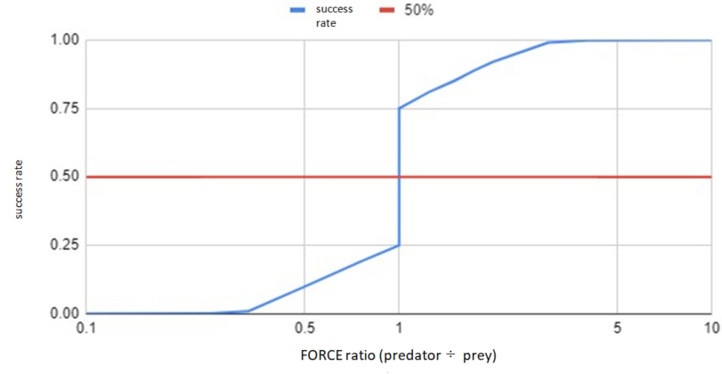

------------------------------------------------
• Attribute Value Increase on Absorb Success
------------------------------------------------
| Based on the specified probabilities, a lottery is conducted for each attribute value to determine the increase.
| Example: There is a 35% chance of increasing the value of an absorbed opponent's attribute by 25% of its value.

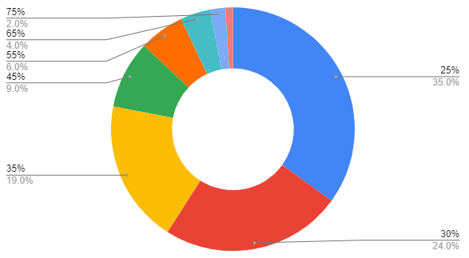

------------------------------------------------
• Attribute Value Decrease on Absorb Failure
------------------------------------------------
| Based on the specified probabilities, a lottery is conducted for each attribute value to determine the decrease.
| Example: There is an 80% chance of decreasing the value of an absorbed opponent's attribute by 65% of its value.

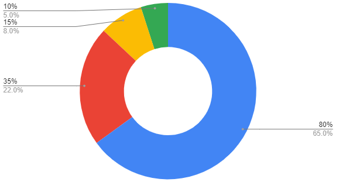

About PERSONA's Attribute Values::

        PERSONA has six attribute values as parameters:
        Attribute values can increase or decrease through Absorb.
        They are also used as conditions for executing DrawChain.

            FOR (Force/Energy)
            ABS (Abyss)
            DFT (Determination)
            MND (Mind)
            INT (Intelligence)
            EXP (Experience)

------------------------------------
Performing Absorbing
------------------------------------
| Absorbing can be performed from the “Absorb” page of My Wallet.
| Select the target PERSONA and ARCANA, then press “Absorb” to execute the process.

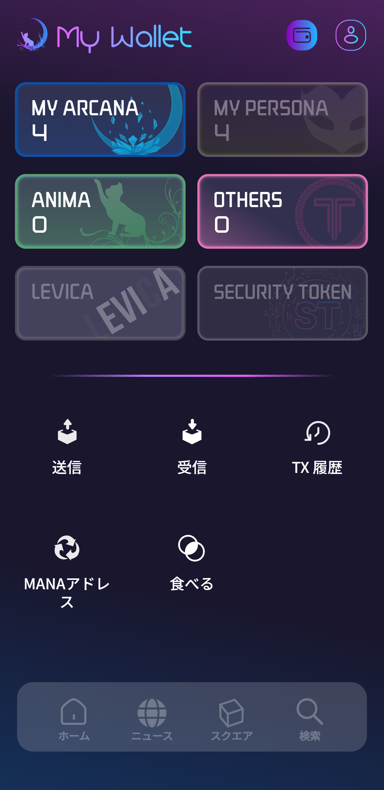
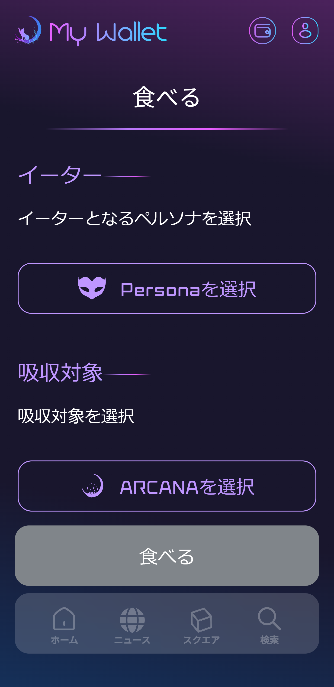
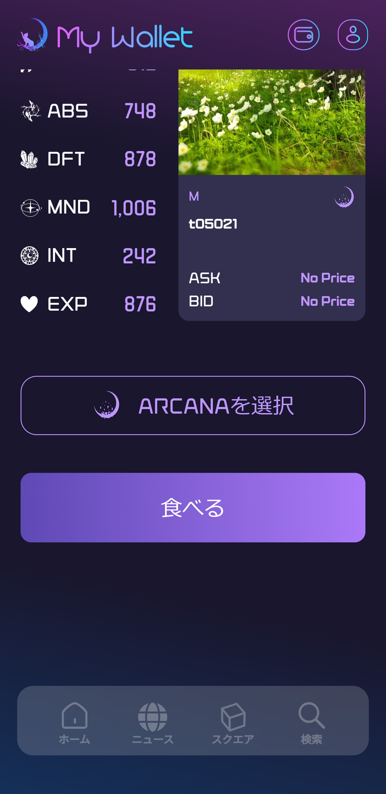

　|wallet_absorb|　|absorb_1|　|absorb_2|

■ Functions Executed by Users During Operation

Execution of Absorb Function (Persona.sol)::

        @param predetor Predator (persona) token ID
        @param prey Prey (arcana) token ID
        @return true: Successful absorption. false: Failed absorption.
        function absorb(uint256 predetor, uint256 prey) public returns (bool)

--------------------------------------------------------------------------------------------------------------------------------

Executing DrawChain
============================================

■ UI

| Registering (subscribing) a Square is a prerequisite for using Drawchain.
| Afterward, you can execute a Draw by selecting the target Drawchain and your own PERSONA.

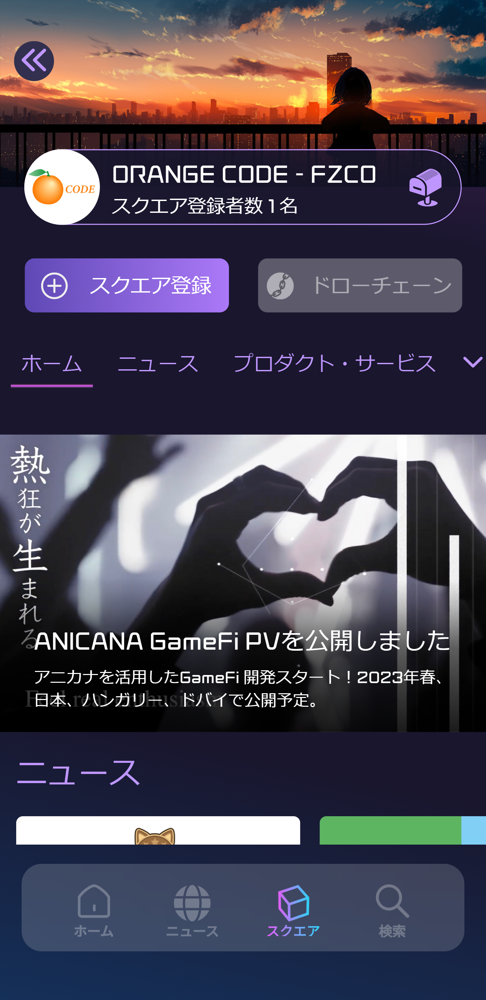
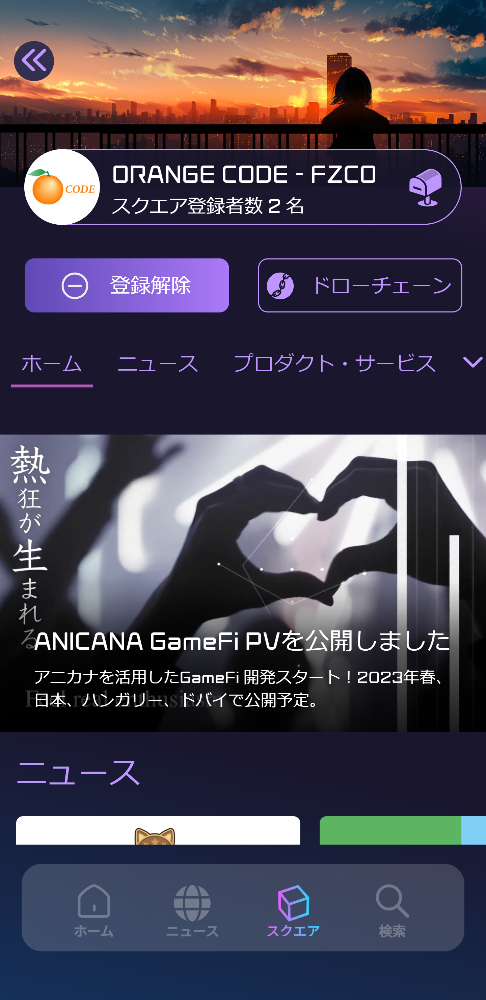
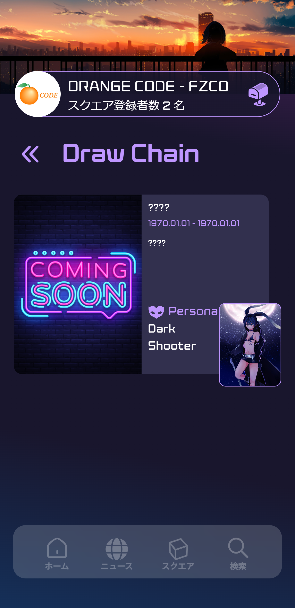
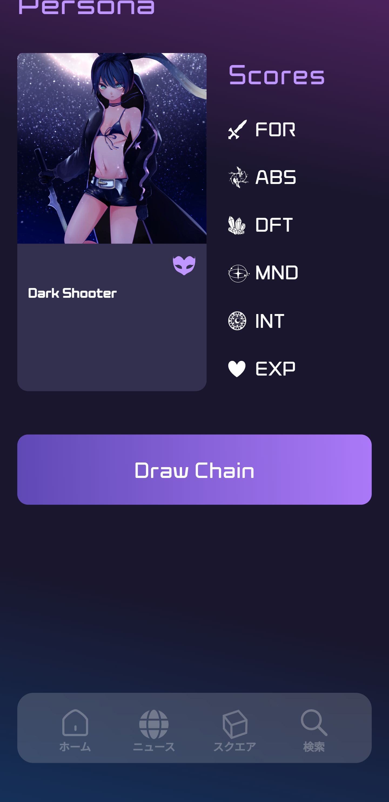
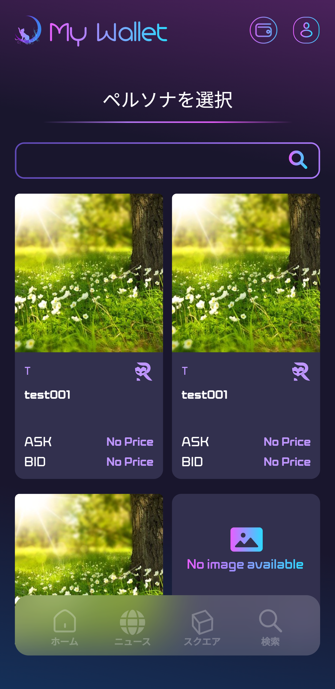
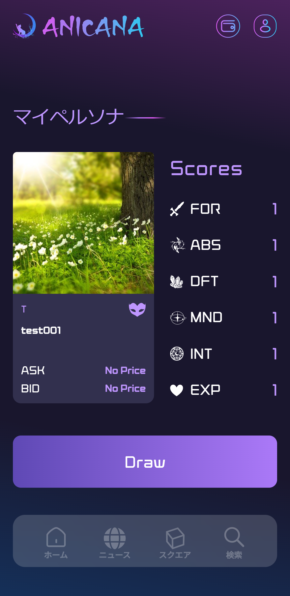

　|draw1|　|draw2|　|draw3|　|draw4|
　
　|draw5|　|draw6|

| ① Draw the DrawChain
| Contract: Drawchain

| ■ Function Executed by Users During Operation

Execute DrawChain Function (Drawchain.sol)::

        @param drawChainId DrawChain ID
        @param personaId Persona ID
        @return 0: Draw failed. Non-zero: Index of history
        function draw(uint256 drawChainId, uint256 personaId) public returns (uint256)

| ② Have the DrawChain creator call it when distributing prizes.
| Register the timestamp of the distribution (delivered).

| ■ Function for Publishers

Register Timestamp Function (Drawchain.sol)::

        @param historyId History Id returned when draw is successful
        function delivered(uint256 historyId)

------------------------------------
DrawChain Execution History
------------------------------------

■ UI

Users can check their own Draw history from the "Draw History" page of the wallet.

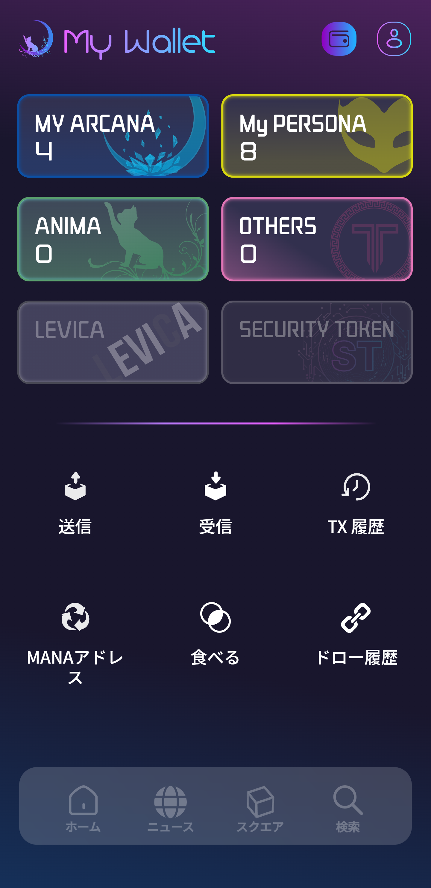
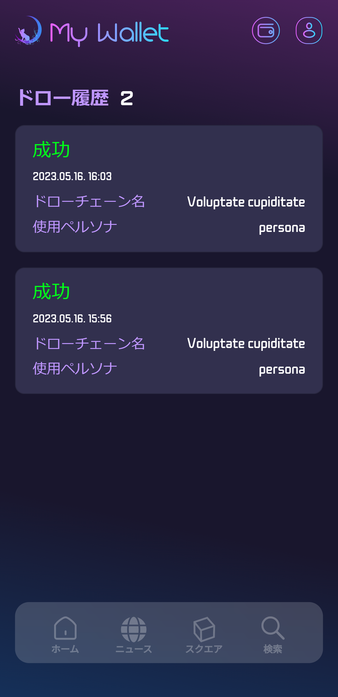

　|draw_hist_1|　|draw_hist_2|

