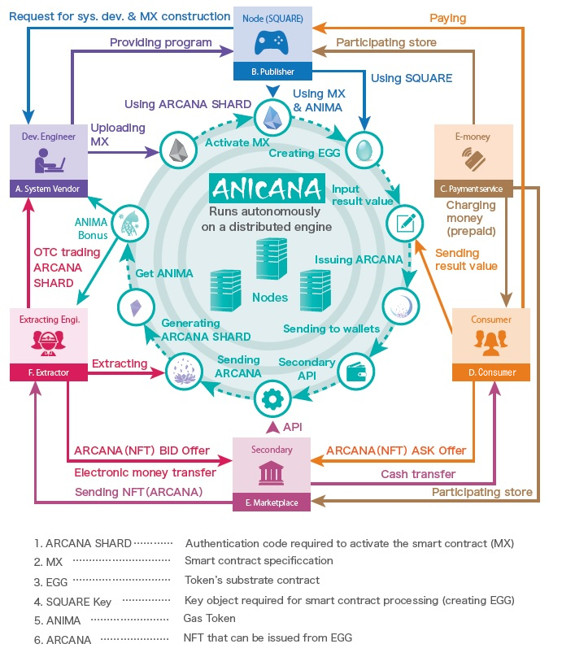

#######################################
ANICANA Life Cycle
#######################################

Development Engineers / System Vendors, etc.
============================================
They mainly provide programs related to the development of MATRIX (hereinafter referred to as “MATRIX”), a smart contract standard that runs on ANICANA, and various authentication for each Validator (content owner / publisher). 
Development engineers design smart contracts based on development contracts for MATRIX from each content owner (publisher) and earn income by broadcasting MATRIX using ARCANA SHARDs. 
In addition, in the circular flow structure, they can receive ANIMA generated by specified tasks.

-----------------------------------------------------------------------------------------------------------------------------------------------------------------------------------------------

Content Owners / Publishers (Validators)
==================================================
Publishers can develop content by linking their services with ANICANA. 
Using the environment (interface call) provided by the publishers, it is possible to generate ARCANA (NFT) on ANICANA using the results of the prepared content. 
Publishers can also provide and sell their own unique tokens (PERSONA) to users and can earn revenue from the sales of contents and PERSONAs, etc.

-----------------------------------------------------------------------------------------------------------------------------------------------------------------------------------------------

Users / Content Users
============================================
Users can purchase prepaid electronic money, etc., and charge for content.
Users who use the content can generate their own ARCANA (NFT) on ANICANA by sending the result value of the content to the Egg (environment) on ANICANA.
Additionally, they can nurture PERSONA by obtaining tokens (PERSONA) provided by content owners, and they can earn revenue by selling ARCANA and PERSONA.

-----------------------------------------------------------------------------------------------------------------------------------------------------------------------------------------------

Secondary Marketplace / Market Operators
=============================================================
It is a service where NFTs and item data related to content on ANICANA can be bought and sold, mainly used for trading ARCANAs and PERSONAs. 
When the offers of the seller and the buyer are matched (contracted), tha marketplace receives the payment and tokens from the buyer, confirms that the payment has been made, and remits the payment and tokens to the seller.

-----------------------------------------------------------------------------------------------------------------------------------------------------------------------------------------------

Extractors / Disassembling Engineers
============================================
They receiving the authentication code “ARCANA SHARD” inherent in ARCANAs, they will become buyers of ARCANAs that are sold on the secondary marketplace. 
Since there is demand for ARCANA SHARD among development engineers, disassembling engineers can earn by selling the those ARCANA SHARDs to development engineers through business contracts. 
Also, similar to development engineers, they can receive ANIMA generated by specified tasks in the circular flow structure.
