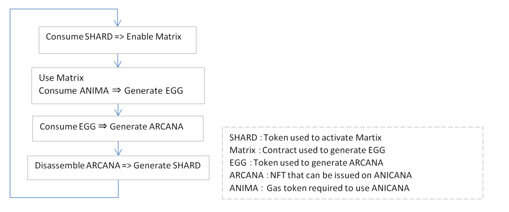

#######################################
ARCANA Life Cycle
#######################################

ARCANA Life Cycle
============================================
1. The EGG tokens, which serve as the basis for generating ARCANA tokens, are generated by the Matrix contract. To activate this Matrix contract, SHARDs are consumed.

2. Using the activated Matrix contract to generate EGG tokens. To generate EGG tokens, ANIMA is consumed.

3. Consuming EGGs to generate ARCANA.

4. By disassembling the generated ARCANA, SHARDs can be generated.

5. The generated SHARDs are used in step 1.