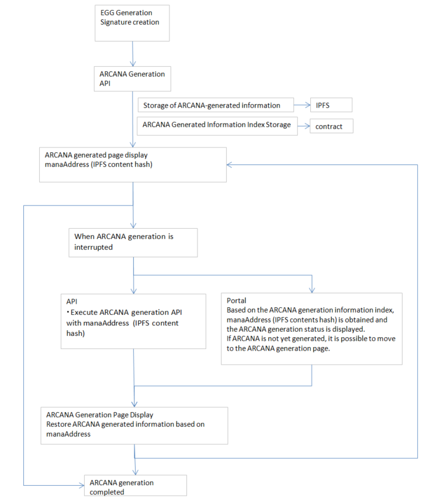

#######################################
Mechanism of ARCANA Generation
#######################################

ARCANA Generation
============================================
| Users can generate ARCANA using the result values of playing content.
| ARCANA can be used for nurturing tokens (PERSONA) provided by content owners or sold in the marketplace.
| By incorporating ARCANA generation functionality, ARCANA generation can be done as a reward for using content.

For more details on generation, refer `here <../appendics/data-sign-text.html>`__.

For information on obtaining generation information, refer `here <../game-development/arcanaGeneratorInfo.html>`__.

-----------------------------------------------------------------------------------------------------------------------------------------------------------

Storage of ARCANA Generation Information (IPFS)
==========================================================

ARCANA generation information is stored on IPFS.
Based on this information, interrupted ARCANA generation can be resumed.

--------------------------------------------------------------------------------------------------------------

Storage of ARCANA Generation Information Index (Contract)
=========================================================================

Storage of indexes to obtain IPFS mana information.