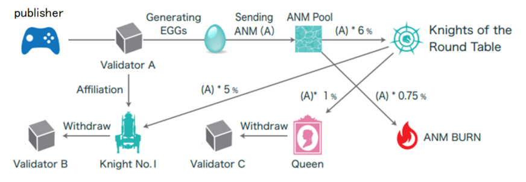

##################################################
Roles in the Knights of the Round Table
##################################################

Roles
============================================
Each Validator holds one of the following roles or attributes. 
For details on the authority and appointment procedures for each role, refer to the White Paper. An overview is provided below.

.. csv-table::
    :header-rows: 1
    :align: center

    "Role", "Maximum Count", "Authority", "Participation in Consensus", "EGG Generation"
    "Queen", "1", "Nomination of Knights", "Yes", "Allowed"
    "Knight", "12", "Approval of Validator Participation", "Yes", "Allowed"
    "Pawns (or Candidates)", "209", "N/A", "No", "Allowed"
    "Unapproved Nodes", "Unlimited", "N/A", "No", "Not Allowed"

* Queen

The Queen holds the authority to nominate and dismiss Knights for Validators participating in ANICANA. 
The Queen is elected by a vote of 12 Knights, with a term limit of 2 years and a maximum of 2 re-elections.

* Knights

| Knights have the authority to approve the participation of Validators who want to join ANICANA. 
| Validators appointed as Knights are assigned a Knight number. 
| Validators cannot reject an appointment by the Queen. When a new Queen is determined, Knights are newly appointed by the Queen.

* Pawns

Pawns are nodes that has joined ANICANA or are candidates for joining ANICANA by being approved by one Knight. 
New Validators who join are assigned the number of the Knight who approved their participation.

----------------------------------------------------------------------------------------------------------------------------------------------------------------------

Receipt of ANM by Knights & Queen
============================================
The Queen automatically receives a certain percentage of ANM from Validators. 
Knights automatically receive a certain percentage of ANM from the Gas (ANM) paid by the Validators (Publishers) they have approved, based on their assigned number.

Queen's Election
============================================
Only Queen and Knights, totaling 13 nodes, can participate in the blockchain consensus. These nodes propose and approve new blocks. 
Roles may change, and the nodes participating in the consensus change accordingly.

* A new Queen is elected from the 12 Knights.
* There is no concept of candidacy in the Queen's election, and Knights cannot vote for themselves.
* A Knight is elected as Queen by obtaining a minimum of 6 votes.
* If the minimum vote requirement is not met, the election will continue until someone achieves the minimum required votes.
* During the absence of the Queen, the supply of ANM to Knights of the Round Table is temporarly suspended, and the expected ANM will disappear.  
  Therefore, the election of the Queen must be determined early.

Vote of No Confidence against the Queen
============================================

* With the agreement of three or more Knights, a vote of no confidence in the Queen can be submitted.
* When a vote of no confidence is submitted, Knights must vote either “confidence” or “no-confidence.”
* The Queen can be dismissed with the votes of 9 Knights of no confidence.
* A Validator who is removed from office due to a vote of no confidence becomes a regular Validator.
* Even if a Knight is reappointed by the new Queen, there is no guarantee that existing Knights will be reappointed.
* If a Knight is reappointed, they will receive ANM linked to the number (seat) of the reappointed Knight's number, even if the Knight’s number (seat) was previously different.

Opening of Validator (Candidate) Nodes
============================================

The total number of Queen, Knights, and Validators has a fixed upper limit, which is a maximum of 222. 
They are sequentially opened according to a pre-designed schedule before reaching the maximum number.

.. csv-table::
    :header-rows: 1
    :align: center

    "Release Year", "Quantity", "Cumulative"
    "2022", "30", "30"
    "2023", "100", "130"
    "2024", "50", "180"
    "2025", "25", "205"
    "2026", "12", "217"
    "2027", "5", "222"