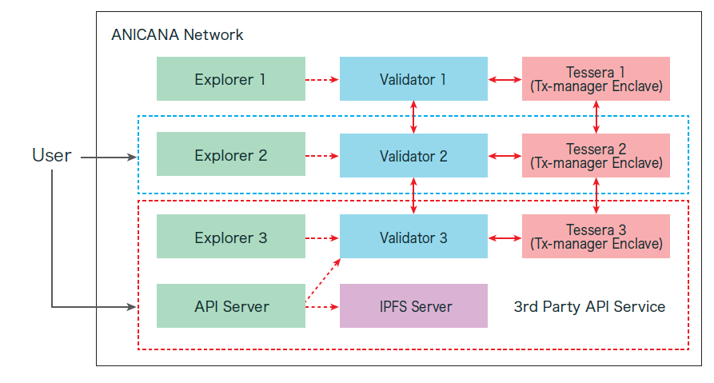

Sure, here's the translation:

###########################
System Configuration
###########################

A single Validator is composed of the following components:

.. csv-table::
    :header-rows: 1
    :align: center

    "Component", "Description"
    "Quorum Node", "The core ANICANA blockchain node"
    "Key Management System", "System for managing Validator's private keys"
    "Validator Management UI", "UI for managing Validator nodes and EGGs"
    "Explorer", "UI for viewing transactions on the ANICANA chain"

--------------------------------------------------------------------------------

Configuration Diagram
=======================

    ANICANA Consortium Chain