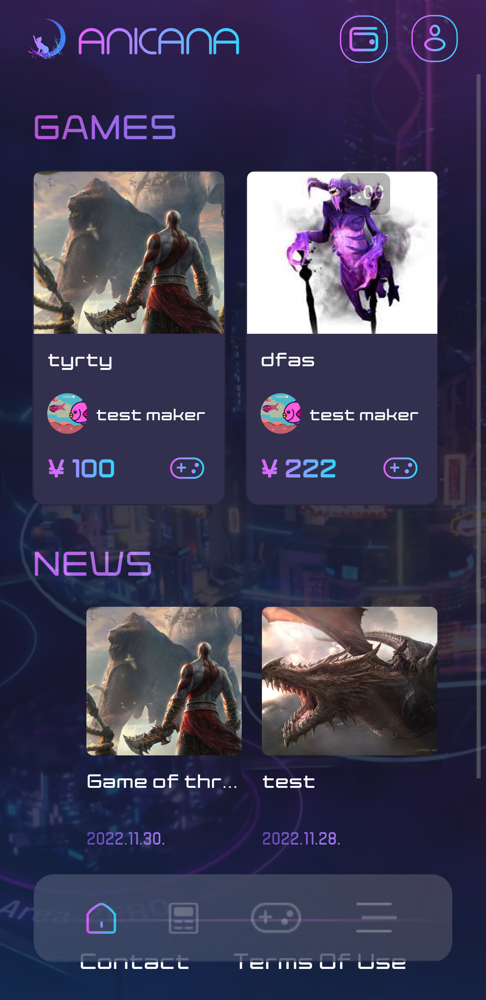
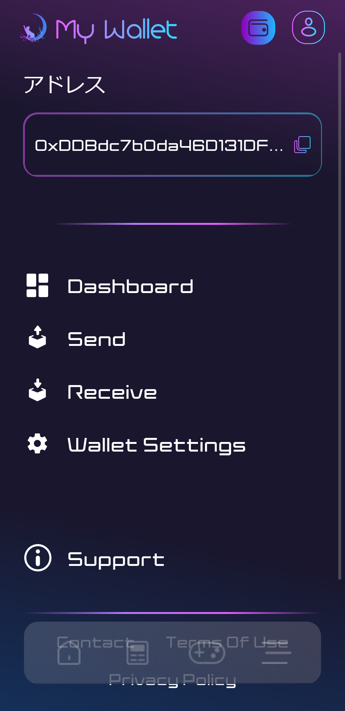
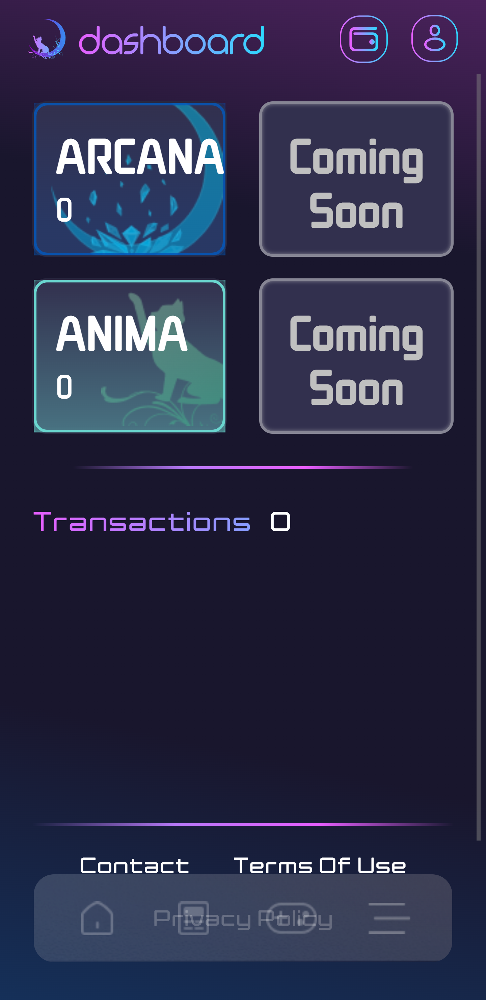

#####################################
ANICANA Wallet Registration
#####################################

The ANICANA portal site provides a wallet user interface, allowing you to generate a wallet by authenticating with your email address.

Please refer to the site URL for environment-specific information.

--------------------------------------------------------------------------------------------------------------

**Wallet Registration Procedure**
=====================================

1. Click "sign up" on the ANICANA portal site to register as a user.

   .. figure:: ../img/wallet-registration/1.png
      :scale: 10%

2. Agree to the terms of use and privacy policy.

   .. figure:: ../img/wallet-registration/2.png
      :scale: 10%

3. Register a profile name.

   .. figure:: ../img/wallet-registration/3.png
      :scale: 10%

4. Upload a profile picture.

   .. figure:: ../img/wallet-registration/4.png
      :scale: 10%

5. Register your email address.

   .. figure:: ../img/wallet-registration/5.png
      :scale: 10%

6. Enter the authentication code sent to your registered email address.

   .. figure:: ../img/wallet-registration/6.png
      :scale: 10%

7. Register your phone number.

   .. figure:: ../img/wallet-registration/7.png
      :scale: 10%

8. Enter the authentication code sent to your registered phone number.

   .. figure:: ../img/wallet-registration/8.png
      :scale: 10%

9. Set a password.

   .. figure:: ../img/wallet-registration/9.png
      :scale: 10%

10. User registration is complete, and the registration completion modal will be displayed.

    .. figure:: ../img/wallet-registration/10.png
      :scale: 10%

11. Sign in with the registered information.

    .. figure:: ../img/wallet-registration/11.png
      :scale: 10%

12. On the wallet connection screen, click "connect."

    .. figure:: ../img/wallet-registration/12.png
      :scale: 10%

13. Enter your email address and click “Continue with Email.”

    .. figure:: ../img/wallet-registration/13.png
      :scale: 10%

14. Wallet registration is complete. You can check your wallet address and token balance on the My Wallet page. 
    Access the My Wallet page using the icon on the top right side.

　|logo1|　|logo2|　|logo3|

